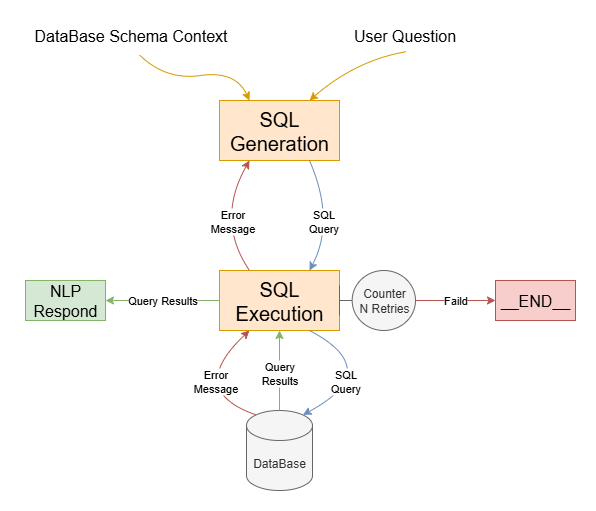

# Natural Language to SQL Experiments

In this repository, I explore and experiment with building natural language interfaces to SQL databases — systems that translate human language queries into executable SQL statements.

## Schema Aware SQL Generation

The following diagram illustrates the schema-aware generation pipeline:


### Context

> First, an LLM is assigned to identify the relevant tables required to handle the user’s request. It returns a list of table names to the next node, which executes a SELECT statement to fetch the first row from each table along with their schemas. This information is then prepared and passed to the SQL generation agent.

#### Nodes Response

```txt
Table: `departments`

Schema: [{'name': 'department_id', 'type': 'INTEGER', 'notnull': False, 'is_primary_key': True}, {'name': 'name', 'type': 'TEXT', 'notnull': True, 'is_primary_key': False}]

Sample Rows (Columns: ['department_id', 'name']):
[{'department_id': 1, 'name': 'Computer Science'}, {'department_id': 2, 'name': 'Mathematics'}, {'department_id': 3, 'name': 'History'}]

---

Table: `students`

Schema: [{'name': 'student_id', 'type': 'INTEGER', 'notnull': False, 'is_primary_key': True}, {'name': 'name', 'type': 'TEXT', 'notnull': True, 'is_primary_key': False}, {'name': 'department_id', 'type': 'INTEGER', 'notnull': False, 'is_primary_key': False}]

Foreign Keys: [{'from_column': 'department_id', 'to_table': 'departments', 'to_column': 'department_id'}]

Sample Rows (Columns: ['student_id', 'name', 'department_id']):
[{'student_id': 1, 'name': 'John Doe', 'department_id': 1}, {'student_id': 2, 'name': 'Jane Roe', 'department_id': 2}, {'student_id': 3, 'name': 'Mark Spencer', 'department_id': 1}]
```

### SQL Generation

> The LLM takes the user’s question along with the relevant schema context to generate an SQL query. Another node then executes the query on the database and handles the retry mechanism.

#### SQL Generation & Retry Mechanism



- The LLM generates the SQL statement based on the input query and schema context.
- The execution node ensures security by blocking harmful or unsafe queries and manages error handling and retry mechanisms.

### Natural Language Response

> Given user question and SQL results to generate a readable response for the user.

### Technologies

`Gemini-SDK` `LangGraph` `Pydantic` `SQLight` `FastAPI` `Uvicorn`
