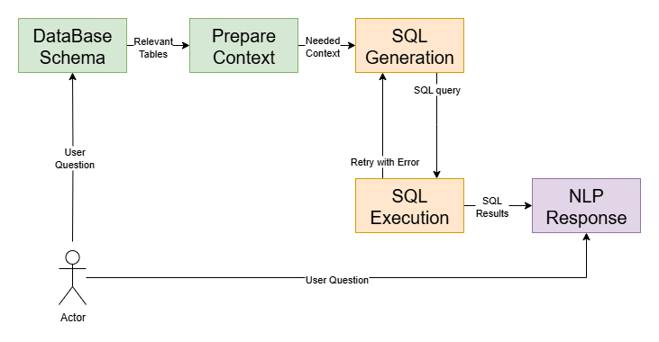

# Natural Language to SQL Experiments

In this repository, I explore and experiment with building natural language interfaces to SQL databases — systems that translate human language queries into executable SQL statements.

## Schema Aware SQL Generation

The following diagram illustrates the schema-aware generation pipeline:



### Context

> First Asssign an LLM to choose relevant Tables that will be needed to handle user request, It will return a list of table names for the next node that will execute a select statement to get first row from each table and the tables schema to prepare this information for the sql generator agent.

```

```